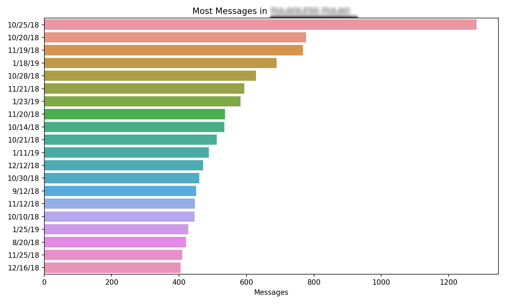
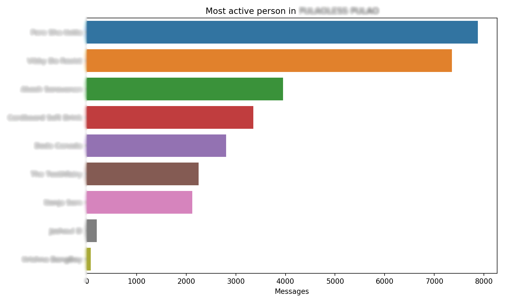
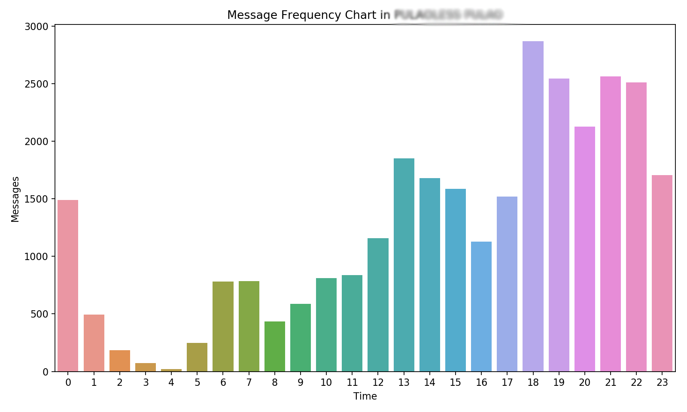
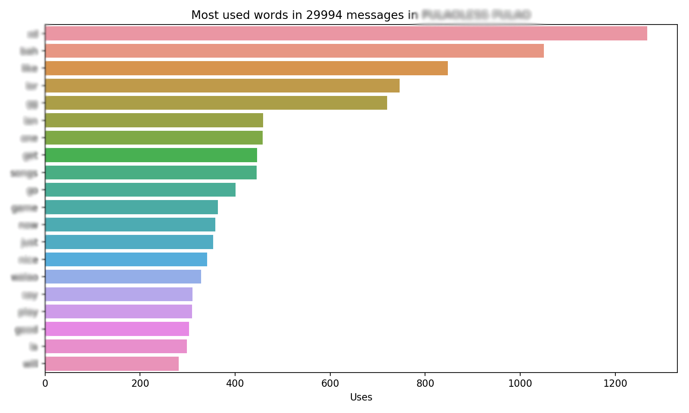

# WhatsApp Message Analyzer

## What is it?

It's a script that analyzes all the messages in a given WhatsApp group chat and visualizes the most active users, the most used words and the dates and times with the most activity.

## Setup & Usage:

1. Download and install Python3.

2. Clone or download this repository and enter the root directory. 

3. Run `pip install -r requirements.txt`

4. Get a chat by going into a group -> Settings -> Email Chat -> No Media.

5. Place the downloaded .txt file containing the chats in the same folder as this script.

6. Run the script in the commandline with the following format:
`analyze.py chat.txt` where chat.txt is the file containing the chats

7. The below images will be generated in an output folder along with an excel sheet containing the formatted data:

```
groupname-data.xlsx
groupname-date_activity.png
groupname-person_activity.png
groupname-time_activity.png
groupname-word_frequency.png
```

## Known Bugs & Issues:

Only messages of the following types have been tested:

* `18/05/16, 7:06:22 PM: ‪username/phone number: message`

* `4/24/17, 6:30 PM - username/phone number: message`

* `[30/04/2015 20:55:13] username/phone number: message`

* `3/25/19, 17:14 - username: message`
 
Other message formats will most likely not work at all. If you find a different format, please open an issue and I'll add it in.

## Screenshots:









## Future Additions:

* Month/Week-wise activity map
* Most media sent
* Longest interval between activity
* Average word count of a message
* Biggest message
* User-based stats: Most active date, most used word, biggest message, average word count
